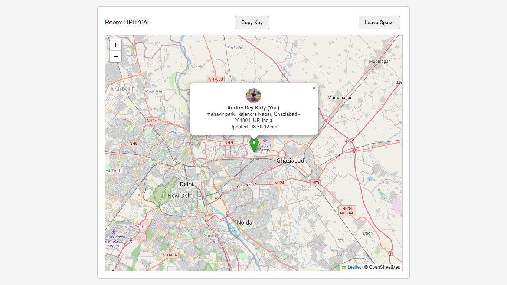
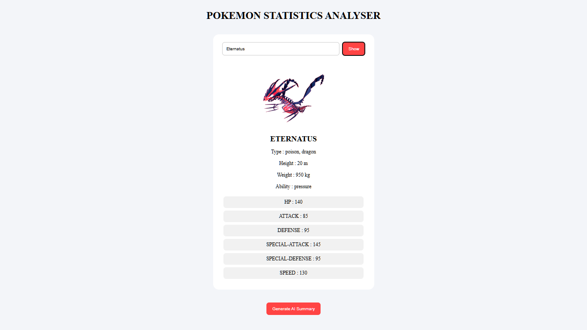
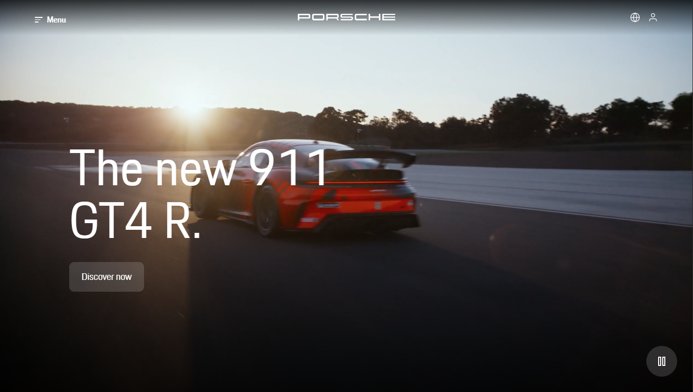
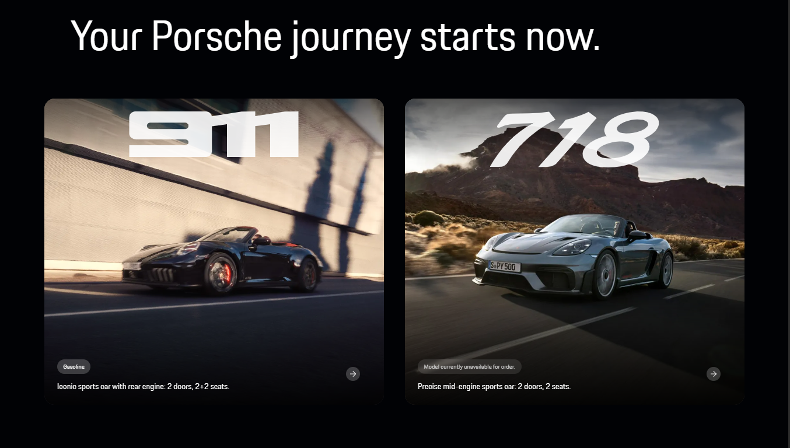
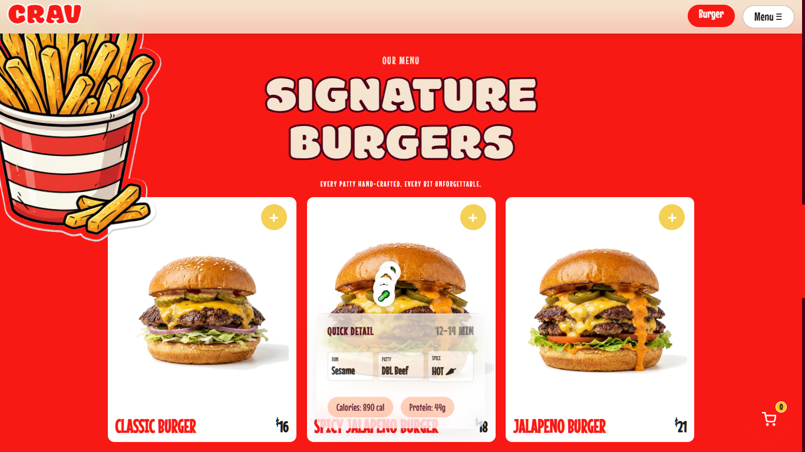

<div align="center">

# Hi, I'm Auritro Dey Kirty

### Full-Stack Developer • Competitive Programmer • Aspiring Software Engineer

<p>
Building scalable web applications, solving algorithmic problems, and turning ideas into real-world products.
</p>

[](https://git.io/typing-svg)


<a href="https://auritrodeykirty07.github.io/Portfolio/">Portfolio</a> •
<a href="https://www.linkedin.com/in/auritro-dey-kirty">LinkedIn</a> •
<a href="https://www.github.com/AuritroDeyKirty07">GitHub</a> •
<a href="https://www.leetcode.com/u/AuritroDeyKirty">LeetCode</a>

</div>

---

# About Me

I'm a **Computer Science undergraduate** and **Full-Stack Developer** passionate about building software that solves real-world problems.

I enjoy taking ideas from concept to deployment, whether it's a real-time location sharing platform, interactive web applications, or developer tools. My focus is on writing clean, scalable code while continuously improving my understanding of backend systems, software architecture, and problem solving.

Alongside development, I actively practice **Data Structures & Algorithms**, participate in coding contests, and build projects that challenge me to learn something new.

### Current Focus

- Building modern Full-Stack Web Applications
- Learning Backend Architecture, Docker & System Design
- Solved **183+ LeetCode Problems**
- Looking for **Frontend / Full-Stack Internship Opportunities**

---

# Tech Stack

<div align="center">

### Languages

[](https://skillicons.dev)

### Frontend

[](https://skillicons.dev)

### Backend & Database

[](https://skillicons.dev)

### Tools

[](https://skillicons.dev)

</div>

---

# Featured Projects

<table>

<tr>

<td width="50%" valign="top">

<h3 align="center">Live Web Tracker</h3>

<p align="center">

<a href="https://github.com/AuritroDeyKirty07/live-web-tracker-app">



</a>

</p>

<p align="center">

<b>JavaScript • Firebase • Leaflet • Geolocation API</b>

</p>

<p>

Real-time location sharing platform featuring Google Authentication, private rooms, interactive maps, and live synchronization between connected users.

</p>

<p align="center">

<a href="https://github.com/AuritroDeyKirty07/live-web-tracker-app">

</a>

</p>

</td>

<td width="50%" valign="top">

<h3 align="center">Pokémon Stat Analyser</h3>

<p align="center">

<a href="https://github.com/AuritroDeyKirty07/Pokemon-Stat-Analyser">



</a>

</p>

<p align="center">

<b>Javascript • PokéAPI • Gemini API</b>

</p>

<p>

Analyze and compare Pokémon statistics with responsive UI, and dynamic data fetched directly from the PokéAPI and Gemini API.

</p>

<p align="center">

<a href="https://github.com/AuritroDeyKirty07/Pokemon-Stat-Analyser">

</a>

</p>

</td>

</tr>

<tr>

<td width="50%" valign="top">

<h3 align="center">Porsche Website</h3>

<p align="center">

<a href="https://github.com/AuritroDeyKirty07/porsche-website-frontend">





</a>

</p>

<p align="center">

<b>HTML • CSS • Javascript • Responsive • Modern UI</b>

</p>

<p>

A premium Porsche-inspired landing page built with modern frontend practices, responsive layouts, smooth animations, and elegant design.

</p>

<p align="center">

<a href="https://github.com/AuritroDeyKirty07/porsche-website-frontend">

</a>

</p>

</td>

<td width="50%" valign="top">

<h3 align="center">Crav Burger</h3>

<p align="center">

<a href="https://github.com/AuritroDeyKirty07/crav-burger-frontend">




</a>

</p>

<p align="center">

<b>HTML • CSS • Javascript • Responsive • UI Design</b>

</p>

<p>

Modern restaurant landing page showcasing responsive layouts, reusable components, and clean frontend architecture.

</p>

<p align="center">

<a href="https://github.com/AuritroDeyKirty07/crav-burger-frontend">

</a>

</p>

</td>

</tr>

</table>

---

# Currently Building

## CodeForge

> **A Full-Stack Competitive Programming Platform**

CodeForge is my flagship project focused on recreating a modern competitive programming ecosystem with authentication, coding battles, analytics, leaderboards, progress tracking, and a scalable backend.

### Planned Features

- JWT Authentication
- Coding Battle Arena
- Analytics Dashboard
- Dynamic Leaderboards
- Daily Coding Streaks
- User Performance Tracking
- Problem Management
- Modern Responsive UI

> **Status:** Private while the backend architecture is being redesigned and prepared for production deployment.

*Coming back stronger soon*

---

# Competitive Programming

<div align="center">

<table>

<tr>

<td align="center" width="33%">

### LeetCode

**183+ Problems Solved**

**Contest Rating:** **1446**

Daily DSA Practice

</td>

<td align="center" width="33%">

### HackerRank

SQL (Intermediate)

Problem Solving

Database Concepts

</td>

<td align="center" width="33%">

### Currently Learning

Backend Development

System Design

Docker

Operating Systems

</td>

</tr>

</table>

</div>

---


# GitHub Analytics

<div align="center">


</div>

<br>

<div align="center">


</div>

---

# Contribution Activity

<div align="center">

[](https://github.com/Ashutosh00710/github-readme-activity-graph)

</div>

---

# Contribution Snake

<div align="center">


</div>

---


# Let's Connect

<div align="center">

<a href="https://auritrodeykirty07.github.io/Portfolio/" target="_blank">

</a>

<a href="https://www.linkedin.com/in/auritro-dey-kirty" target="_blank">

</a>

<a href="mailto:deykirtyauritro@gmail.com">

</a>

<a href="https://github.com/AuritroDeyKirty07">

</a>

</div>

---

# Fun Facts

```cpp
while(alive)
{
    Learn();
    Build();
    Debug();
    Repeat();
}
```

- Building products that solve real problems.
- Enjoy Full-Stack Development & Competitive Programming.
- Learning something new every single day.
- Can spend hours debugging... only to discover a missing semicolon.

---

# Current Goals (2026)

- 250+ LeetCode Problems
- 1600+ LeetCode Rating
- Deploy CodeForge publicly
- Build production-ready MERN projects
- Secure a Software Development Internship
- Learn System Design & DevOps fundamentals

---

# Highlighted Repositories

| Repository | Description |
|------------|-------------|
| Live Web Tracker | Real-time location sharing platform with Google Authentication & Leaflet |
| CodeForge *(Private)* | Full-Stack Competitive Programming Platform |
| Pokémon Stat Analyser | Interactive Pokémon analytics dashboard |
| Porsche Website | Premium React landing page |
| Crav Burger | Modern responsive restaurant website |
| Pokémon Battle Simulator | Battle simulator using PokéAPI |

---

<div align="center">

## Thanks for visiting!

If you enjoy my work, consider ⭐ starring a repository.

I'm always excited to learn, collaborate, and build impactful software.


</div>
